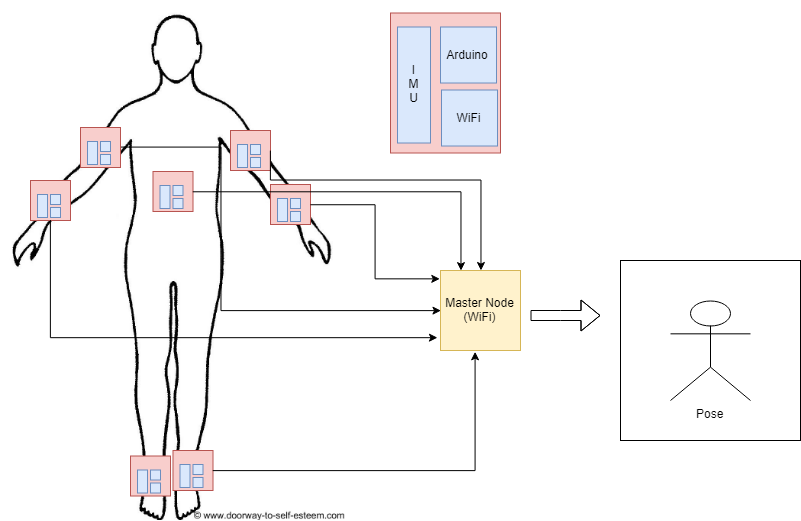

# 18-748 Wireless Sensor Networks, Spring 2018

## Christopher Hung (christoh), Rini Patel (rinip), and Tushar Goyal (tgoyal1)

<a class="nav"  href="https://rinipatel.github.io/PoseCapture/Project_Scope_Document.pdf" target="_blank">Project Scope</a>

## Introduction
For our project, we plan to implement a system that will track a user’s movements as they move their limbs. This system will use a network of nodes each with an IMU that will collect the data and relay it back to a master on a PC, which will collect the data and track the motion of each individual node.

## Motivation 
The motivatio behind this project is the cases when we require mobility, flexibility and line of sight requirement is not necessary. We want to take a wireless approach with inertial measurement sensors where the sensors could be attached to the body and the receiver software running on the host would use the inertial data to estimate the pose of the subject. The term inertial sensor comes from the group of sensors consisting of 3-axis accelerometer and gyroscope coupled with a magnetometer. The methodology doesn’t suffer from portability and cost concerns since the sensors are relatively cheap and can be reused for multiple physique and age groups and have no constraints of weight and frame design for body movement etc. Additionally, unlike the cases of optical capture techniques where the video feed should be directly pointing at the human subject, the only constraint on the methodology would be the wireless network range to which sensors can send the data to the master where the pose can be estimated and there is no requirement of in direct line of sight. 

## Key Use Cases
- Computer Animation
- Virtual Reality
- Film industry
- Gaming
- Robotics 

## System Design 
Key hardware components for our project:
- Arduino Uno boards + WiFi shields
- IMU Sensors

IMU sensor nodes will be mounted on Arduinos. Each Arduino board will collect rotation and acceleration data from IMU sensor, and send it wirelessly using ESP WiFi modules to the master node, which is an Arduino board attached to PC. Master node having received data from all sensor nodes, will offset it with the initial calibrated values of pose and try to estimate the new pose. The main focus is on developing system with low latency and getting more real-time estimation of movements. The master node will have fixed sampling time for receiving the new pose data, and after that it will update the visual representation of pose in form of stick figures.

## References

1. [Using Inertial Sensors for Position and Orientation Estimation](https://arxiv.org/pdf/1704.06053.pdf)
2. [Inertial Motion Capture Costume Design Study](https://www.ncbi.nlm.nih.gov/pmc/articles/PMC5375898/)

