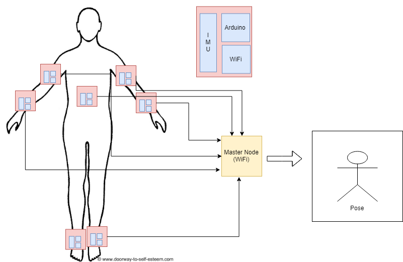

## Introduction
For our project, we plan to implement a system that will track a user’s movements as they move their limbs. This system will use a network of nodes each with an IMU that will collect the data and relay it back to a master on a PC, which will collect the data and track the motion of each individual node.

## Motivation 
The motivation behind this project is the cases when we require mobility, flexibility and line of sight requirement is not necessary. We want to take a wireless approach with inertial measurement sensors where the sensors could be attached to the body and the receiver software running on the host would use the inertial data to estimate the pose of the subject.

## Key Use Cases
- Computer Animation
- Virtual Reality
- Film industry
- Gaming
- Robotics 

## System Design 
Key hardware components for our project:
- Arduino Uno boards + WiFi shields
- IMU Sensors

## References

1. [Using Inertial Sensors for Position and Orientation Estimation](https://arxiv.org/pdf/1704.06053.pdf)
2. [Inertial Motion Capture Costume Design Study](https://www.ncbi.nlm.nih.gov/pmc/articles/PMC5375898/)

