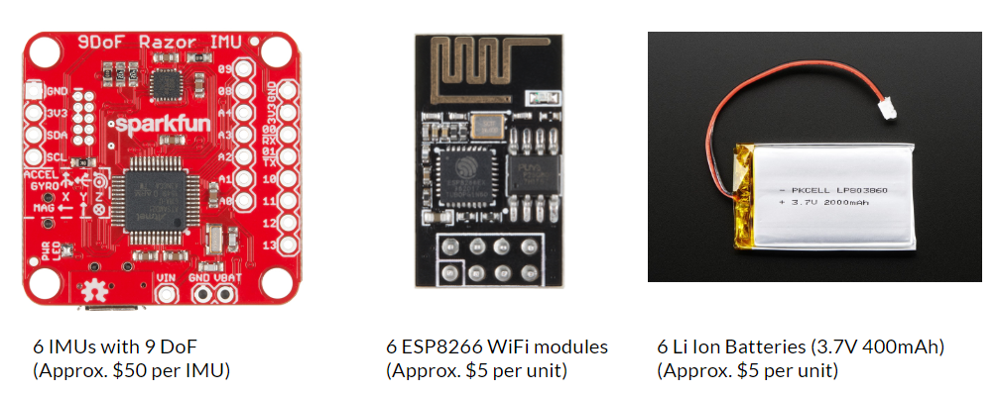

<em>Updated May 7th, 2018</em>

### Index
______

1. [Introduction](#introduction)
   - [Motivation](#motivation)
   - [Project Goals](#goals)
2. [Key Use Cases](#uses)
3. [System Design](#system)
	- [Body Model](#model)
    - [Blender and Unity 3D Animation](#example)
4. [Project Status](#status)
5. [Conclusion](#conclusion)
5. [References](#ref)

### <a name="introduction">Introduction</a>

We implemented a wireless system that captures a person’s movements as they move their limbs. The system uses a network of nodes each with an IMU which relay the orientation measurements for the respective limbs to a master on a PC, which processes the data and represents the estimated pose in form of graphical 3D model.

#### <a name="motivation">Motivation</a>

Following are the popular approaches to do pose capture:
- Wired sensors - becomes tangled and difficult to move around in
- Mechanical frames with sensors - intrusive and non-portable
- Computer vision - illumination differences and obstructions limit accuracy

The motivation behind this project is the cases when we require mobility, flexibility and line of sight requirement is not necessary. We took a wireless approach with inertial measurement sensors (IMUs), where the sensors could be attached to the body and the receiver software running on the host would use the inertial data to estimate the pose of the subject.

#### <a name="goals">Project Goals</a>

The main goal of the project is to get a full body capture of the person using 
1. A wireless sensor network
2. Which is robust under variety of environmental conditions, and 
3. Use the orientation data from IMUS to post process in the form of 3D body model.

### <a name="uses">Key Use Cases</a>

The most definitive use of our project is in computer animation. Rather than manually moving the limbs of a character, the animator can build a model of the character, act out the desired motion physically, and apply the recorded motions directly to the limbs of the model. This animation could be used in film making, game development etc.

### <a name="system">System Design</a>

To implement our solution, we built a network of several sensor nodes that communicate to a master. The data collected from these nodes allows the master to get the orientation of each node with respect to global frame. With the nodes situated on key parts of the user’s body, the orientation and position of each node will give enough information for the master to estimate a pose.

Key hardware components for our project:
- IMU Sensors (SparkFun 9DoF Razor IMU M0)
- Batteries for IMUs (Li Ion Batteries (3.7V 400mAh))
- WiFi shields (ESP8266 WiFi modules)

#### <a name="model">Body Model</a>

We are using a hip rooted body model where all the movements of bones are rooted on a tree as shown in Figure 3. This defines the relative position of bones and helps in modelling body motion and movements correctly. For example, upper arm  is parent of lower arm thus a movement in upper arm would cause motion in lower arm as well. The same model is being used by Blender and Unity.

 

#### <a name="example">Blender and Unity 3D Animation</a>

The Blender visualization is powered by a series of controllers called once every program tick. One controller reads all the WiFi packets in the buffer and stores the latest one from each of the nodes. Another controller updates the position of the model using the 3 yaw, pitch, and roll angles.

Controllers are written in Visual Studio C#. One software thread running in background to continuously reads from WiFi UDP port of host PC, and event-driven controllers for each sensor node update the graphical movement of associated limb on screen at the rate of 10fps.

### <a name="status">Project Status</a>

### <a name="conclusion">Conclusion</a>

### <a name="ref">References</a>

1. [Using Inertial Sensors for Position and Orientation Estimation](https://arxiv.org/pdf/1704.06053.pdf)
2. [Inertial Motion Capture Costume Design Study](https://www.ncbi.nlm.nih.gov/pmc/articles/PMC5375898/)
